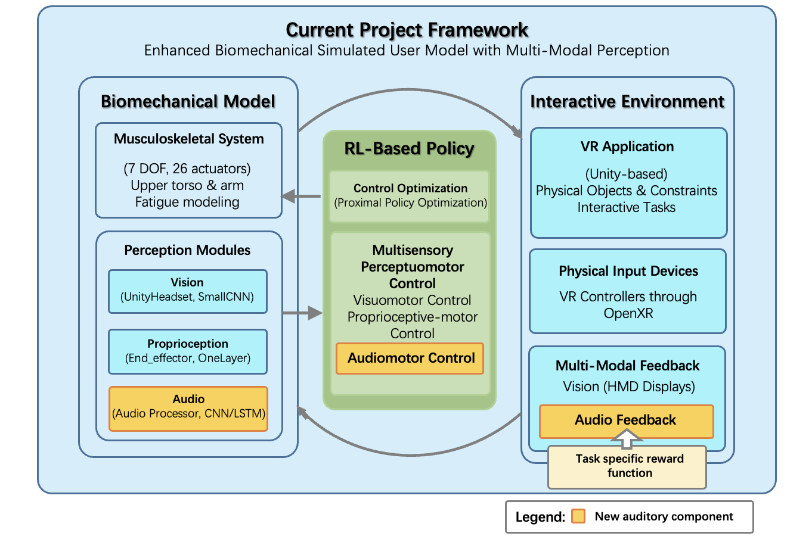

# SIM2SENSE

> **SIM2SENSE**: A reinforcement learning-based simulation framework for multi-sensory, biomechanical user interaction in virtual reality.

SIM2SENSE extends the [SIM2VR](https://doi.org/10.1145/3654777.3676452) framework by incorporating auditory perception into biomechanical user models. It supports spatial and temporal audio, visual, and proprioceptive feedback, enabling more ecologically valid simulations of human interaction in VR environments.

---

## 🔍 Overview

- 🔊 **Auditory Perception**: Integrates stereo (spatial) and mono (temporal) audio cues.
- 🤖 **Reinforcement Learning**: Trains policy networks using Proximal Policy Optimization (PPO).
- 🦾 **Biomechanical Arm Model**: 7-DoF muscle-actuated upper limb (MuJoCo).
- 🎮 **Unity VR Tasks**: Supports Whac-A-Mole and Beat Saber-style games.
- 🧪 **Multi-modal Evaluation**: Hit rate, reaction time, and movement plausibility analysis.

---

## 🧠 System Architecture



1. VR Environment (Unity)  
2. Sensory Channels (Vision, Proprioception, Audio)  
3. Encoders (CNN, LSTM)  
4. PPO-based Policy Network  
5. Muscle-Actuated Arm (MuJoCo)  

---
## 📊 Whac-A-Mole Task Results

### 🧪 Quantitative Results


| Model # | Model Configuration               | Hit Rate (%) | Mean RT (s) | Std RT (s) |
|---------|-----------------------------------|--------------|-------------|------------|
| 0       | Vision Only (Baseline)            | 69%          | 0.198       | 0.074      |
| 1       | Vision + Audio                    | 79%          | 0.053       | 0.013      |
| 3       | Vision + Audio (Sparse Reward)    | 53%          | 0.079       | 0.049      |
| 5       | Vision + Audio (Mono)             | 100%         | 0.062       | 0.025      |
| 2       | Audio Only                        | 22%          | 0.233       | 0.076      |
| 4       | Audio Only (Sparse Reward)        | 23%          | 0.250       | 0.190      |
| 6       | Audio Only (Mono)                 | 52%          | 0.202       | 0.115      |


### Qualitative Differences
- Vision-based agents: Bent elbow, energy-efficient motion.
- Audio-based agents: Extended arms, direct but less biomechanically plausible.

---


## 🚀 Getting Started

### Requirements

- Python 3.9+
- [MuJoCo 2.3.1](https://mujoco.org/)
- Unity 2021+ (with OpenXR support)
- `pip install -r requirements.txt`

### Launch Unity VR Environment

1. Clone the [whac-a-mole](https://github.com/Leahh147/whac-a-mole.git) to your local repo.
2. Open `whac-a-mole` in Unity Editor.
3. Play or build the environment.

### Train a Model

```bash
python uitb/train/trainer.py uitb/config/mobl_arms_whacamole_constrained_linux_train_4.yaml
```

## 📊 Evaluation
```bash
python uitb/test/evaluator.py simulators/whacamole_constrained_linux_train_4 --record --num_episodes 10 --random_seed 1024 --unity_random_seed 4096
```
Results are visualized using Weights & Biases.

## 📈 Visualization Tools
All graphs and plots used in this project were generated using the companion repository:  

👉 [uitb_graphs](https://github.com/Leahh147/uitb_graphs.git)

This includes:  

- Hit rate and reaction time plots
- Whac-A-Mole spatial performance maps

## 📎 Related Projects

- [SIM2VR](https://github.com/fl0fischer/sim2vr.git) – Unity-based extension of User-in-the-Box
- [UitB](https://github.com/User-in-the-Box/user-in-the-box.git) – Biomechanical RL-based user simulation
- [ml-audio-sensor](https://github.com/mbaske/ml-audio-sensor.git) – In-game audio sensor used in SIM2SENSE

## 🧑‍💻 Author

Jiahao He  
Department of Engineering, University of Cambridge  
Email: leah12577@gmail.com  
GitHub: Leahh147

## 🛠 Acknowledgments

This project extends work by Fischer et al. (SIM2VR, UIST 2024) and Ikkala et al. (User-in-the-Box, UIST 2022).  
Thanks to Dr. Florian Fischer and Prof. Per Ola Kristensson for their supervision and guidance.
